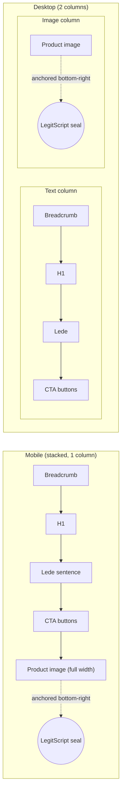
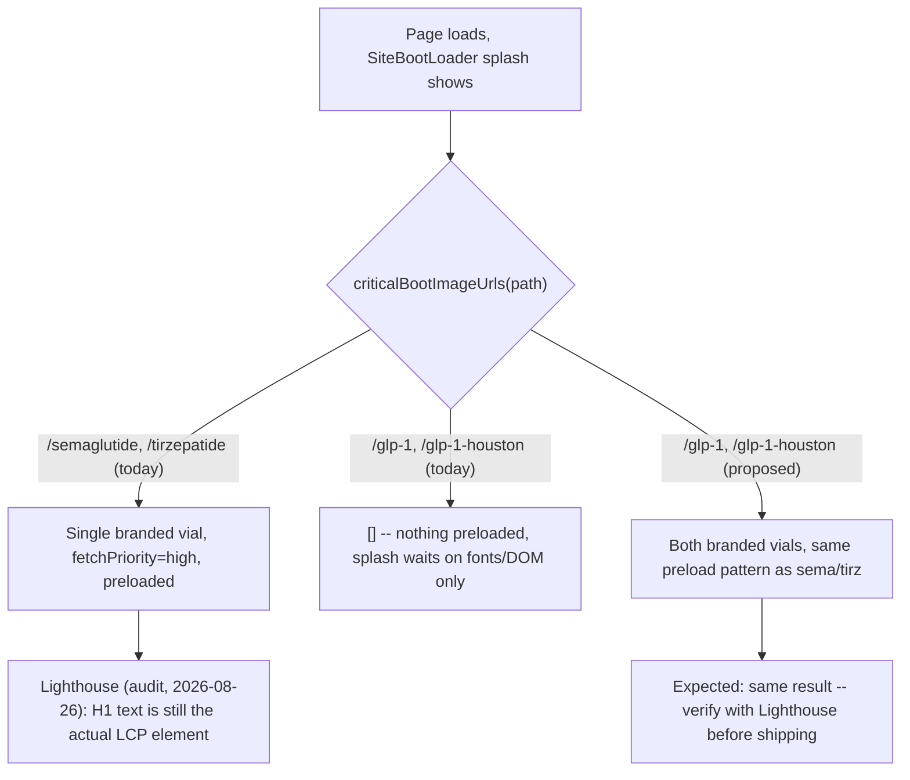
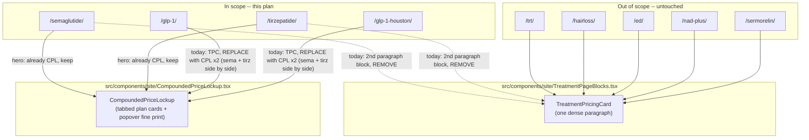
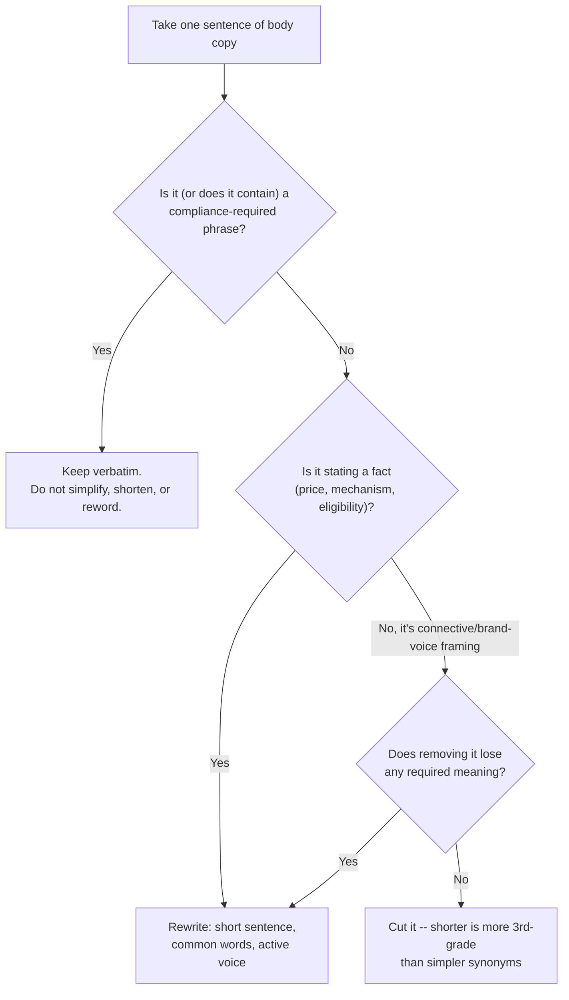

# GLP-1 money page redesign: hero, pricing, reading level

**Status: planning only.** Nothing in this document has been implemented. Matt will branch off `main` separately when it's time to build. This plan is the reference for that work.

## Scope

Exactly 4 pages, weight-loss copy only:

| Page | Route file | Role |
|---|---|---|
| `/glp-1/` | `src/routes/glp-1.tsx` → `Glp1LandingPage` | National GLP-1 category page |
| `/glp-1-houston/` | `src/routes/glp-1-houston.tsx` → `Glp1LandingPage` | Houston ads landing page |
| `/semaglutide/` | `src/routes/semaglutide.tsx` | Compounded semaglutide product page |
| `/tirzepatide/` | `src/routes/tirzepatide.tsx` | Compounded tirzepatide product page |

**Explicitly out of scope:** `/trt`, `/hairloss`, `/ed`, `/nad-plus`, `/sermorelin` (Matt is doing a separate pass on those himself), the footer, jurisdictional/legal pages, `docs/marketing/SEO-AEO-GEO-PLAN.md` compliance rules themselves. Several components below (`TreatmentPricingCard`, `TreatmentPageBlocks.tsx`) are shared with the 5 out-of-scope pages — the plan is written so those pages' code paths are untouched.

## Why (recap)

1. **Audit bug (High severity, 2026-08-26 SEO/GEO audit):** on `/glp-1-houston/` mobile, the LegitScript seal renders centered above the H1 and pushes the "Get Started" CTA below the 812px viewport — the only entry point into the Bask intake funnel.
2. **Same audit, SXO finding:** the seal is *missing entirely* on `/semaglutide/` and `/tirzepatide/`, which the audit calls "the single biggest driver of the price-sensitive shopper persona's low Trust score."
3. **Pricing is a wall of text.** `TreatmentPricingCard` (`TreatmentPageBlocks.tsx:74-158`) renders every plan length, the starter pack, savings amounts, and promo-code rules as one dense paragraph. It's used as the *primary* pricing block on `/glp-1/` and `/glp-1-houston/`, and as a *secondary* reinforcement block partway down `/semaglutide/` and `/tirzepatide/` (which already have something better in their hero — see below).
4. **Good news: the fix already exists in the codebase.** `CompoundedPriceLockup` (`src/components/site/CompoundedPriceLockup.tsx`) is a tabbed, card-based pricing widget — plan-length tabs, a "Save $X" badge, a collapsed popover for the fine print — already live in the `/semaglutide/` and `/tirzepatide/` **heroes**. It just isn't used on `/glp-1/`/`/glp-1-houston/` at all, and isn't reused to replace the paragraph further down `/semaglutide/`/`/tirzepatide/`.
5. **Hero pattern gap.** `/glp-1/` and `/glp-1-houston/` use a plain centered pattern (breadcrumb → seal → eyebrow → H1 → paragraph → 2 buttons), while `/semaglutide/` and `/tirzepatide/` already use a stronger two-column pattern (headline column + product-image column). Unifying all 4 pages onto the stronger pattern is most of this redesign.

---

## 1. Hero redesign

### Target pattern: Trust & Authority + Conversion (telemedicine-standard)

```mermaid
flowchart TD
    subgraph before["Current /glp-1-houston/ hero (top to bottom)"]
        b1[Breadcrumb] --> b2[LegitScript seal, centered]
        b2 --> b3[Eyebrow]
        b3 --> b4["H1 (2-line creative headline)"]
        b4 --> b5[One paragraph of body copy]
        b5 --> b6["CTA buttons -- pushed off mobile viewport"]
    end

    subgraph after["Proposed hero, all 4 pages"]
        a1[Breadcrumb] --> a2["H1 = literal page keyword"]
        a2 --> a3["One-sentence concrete lede: price or mechanism, not brand copy"]
        a3 --> a4[CTA buttons -- nothing above them but the lede]
        a4 --> a5["Product image column (own stacking context, see LCP section)"]
        a5 --> a6["LegitScript seal anchored to a corner of the image, not stacked above text"]
    end
```

Key change: the seal moves from "stacked above everything, centered" to "anchored to the product-image panel." On mobile, where the layout stacks to one column, the image (and seal) render **after** the CTA buttons in source order — so the CTA is never pushed down. On desktop, the seal sits in the image panel's corner, not in the text column at all. This closes the audit's #1 finding structurally, not with a size/position tweak.

### H1 rule (non-negotiable, per your instruction)

The H1 stays the literal target keyword/page name — no creative headline swap. The "personalized around you" / "guided by licensed medical professionals" tails currently on `/semaglutide/` and `/tirzepatide/` move out of the H1 and into the lede sentence underneath it (where they can still carry warmth, just not compete with the keyword for the H1's weight).

| Page | Current H1 | Proposed H1 |
|---|---|---|
| `/semaglutide/` | "Compounded Semaglutide, personalized around you." | "Compounded Semaglutide" (matches `<title>` "Compounded Semaglutide for Weight Loss") |
| `/tirzepatide/` | "Compounded Tirzepatide, guided by licensed medical professionals." | "Compounded Tirzepatide" |
| `/glp-1/` | "GLP-1 weight-loss options" | "GLP-1 Weight-Loss Care" (matches `<title>` "Online GLP-1 Weight Loss") |
| `/glp-1-houston/` | "GLP-1 weight-loss care for Houston, online" | "GLP-1 Weight-Loss Care in Houston" (matches `<title>`) |

This also directly closes the audit's On-Page/GEO finding ("commercial pages open with brand/process copy before the concrete fact") — the lede sentence right under the H1 becomes the place for the concrete price/mechanism fact the audit wanted moved up, e.g. *"Semaglutide is a GLP-1 medication that helps you feel full longer, from $99 the first month."* instead of brand-voice copy.

### Seal placement — decision

You said top-right or bottom-right, your call. Going with **bottom-right corner of the product-image panel**, using the existing `FloatingLegitScriptSeal` component (already built for the homepage) with new position classes:

Rationale: bottom-right keeps the seal near the CTA psychologically (same visual block as the "biggest reason to trust this purchase" image) without ever sitting *above* the CTA in source order on any breakpoint — the exact failure mode the audit caught. Reuses `FloatingLegitScriptSeal`'s existing entrance/bob animation, just new `className`/`sealClassName` position props (same pattern as `HomeHero.tsx:210-213` and `:381-384`) — no new component needed.

### Images + LCP — decision

`docs/features/treatment-pages.md` currently documents `/glp-1`/`/glp-1-houston` as deliberately image-free ("headline is LCP... do not fetch unused vial PNGs"), while `/semaglutide`/`/tirzepatide` already preload a single branded vial photo at `fetchPriority="high"` via `bootImagePreloadLinks()`/`criticalBootImageUrls()` in `src/lib/boot-assets.ts`. The 2026-08-26 audit's own Lighthouse traces found the **hero text**, not the hero image, was the actual LCP element on every sampled page — including the two pages that already preload an image. So adding images to `/glp-1/`/`/glp-1-houston/` using the *same proven pattern* sema/tirz already use is low-risk, not a new risk:

- `/semaglutide/`, `/tirzepatide/`: keep the existing single-vial image, just resize it to match its actual display slot (closes the audit's Images finding — "~63KB wasted each," oversized source into a smaller slot) and move the seal off the top of the hero and onto this image's corner.
- `/glp-1/`, `/glp-1-houston/`: add a two-vial hero visual (both branded assets already exist — `resolveVialImagery("semaglutide")` / `resolveVialImagery("tirzepatide")`, no new photography), extend `criticalBootImageUrls()`/`warmupBootImageUrls()` in `boot-assets.ts` for these two paths, and add `bootImagePreloadLinks()` to their route `head()` the same way sema/tirz already do.
- **Validation gate before shipping:** re-run a Lighthouse/CWV check (the `claude-seo` `seo-performance` agent, or the audit's own method) on all 4 pages specifically for LCP timing and element identity. If adding the image measurably regresses LCP on `/glp-1`/`/glp-1-houston`, fall back to loading it without `fetchPriority="high"`/without the boot-splash wait (image stays secondary, text stays LCP) rather than shipping a regression.

---

## 2. Pricing section redesign

### Component reuse map

No new pricing UI component needed — `CompoundedPriceLockup` already is the tiered/card pattern research recommends. The change is *which pages use which existing component*, not new UI.

- **`/semaglutide/`, `/tirzepatide/`:** delete the second `TreatmentPricingCard` block (currently paired with the "Eligibility" card around line 387 of each route file). The hero's `CompoundedPriceLockup` already covers this — a second full price dump right after was pure repetition. Replace that section with something lighter: eligibility card stays, pricing side becomes a compact reinforcement (e.g. "See full pricing above" anchor link, or nothing — TBD during implementation, not a compliance requirement either way).
- **`/glp-1/`, `/glp-1-houston/`:** replace the current "Cash-pay pricing" section's two `TreatmentPricingCard`s with two `CompoundedPriceLockup` widgets side by side (same component, `interactive` mode, one per medication) — same UI patients already see and can compare on the individual drug pages, so switching from the hub page to a drug page doesn't re-teach a new pricing UI.
- **`TreatmentPricingCard` itself is not touched.** The 5 out-of-scope pages keep using it exactly as today.

---

## 3. Reading-level pass (3rd-grade target, outside compliance-locked text)

### Decision rule

### Locked phrases (verbatim, sitewide, from `docs/features/treatment-pages.md` §Compliance) — never touched by this pass

1. `"Compounded {drug} is not FDA-approved and is considered only when legally available and clinically appropriate."`
2. "Prescribing is never guaranteed" (and equivalents already standardized in `medication-pricing.ts` helper functions like `compoundedMonthlyPricingSentence`).
3. No "medically reviewed" language; `reviewedByClinicalLead: false` on every JSON-LD call — untouched, this is data not copy.
4. No claims of FDA-approved equivalence ("same active ingredient," "clinically proven," "generic").
5. All dollar amounts and plan math — these come from `medication-pricing.ts` functions, not hand-written copy. Simplifying prose around them is fine; changing the numbers or what they mean is not in scope of a copy pass at all.

### Section-by-section treatment (per page)

| Section | Example location | Treatment |
|---|---|---|
| H1 | all 4 pages | No change beyond the keyword trim above — already short. |
| Hero lede (1 sentence) | replaces current hero `description` | Full rewrite, 3rd-grade: short, concrete, one fact. |
| "What is semaglutide?" / "What is tirzepatide?" body | `semaglutide.tsx:289-321` | Rewrite connective sentences; keep the one compliance sentence ("is not FDA-approved and is considered only when...") verbatim inside a shorter paragraph. |
| Safety & eligibility cards | `semaglutide.tsx:395-455` | Rewrite headers/framing; the "not FDA-approved... not assumed identical to branded" sentence and the clinical-oversight attribution sentence stay verbatim. |
| Serving-area section (`/glp-1-houston/`) | `Glp1LandingPage.tsx:186-253` | Rewrite freely — no compliance-locked language in this block today per current copy. |
| FAQ answers | `glp-1-landing.ts` `SHARED_FAQ`, `semaglutide.tsx` `FAQ_ITEMS` | Hardest section — these are long paragraphs that interleave plain explanation with compliance sentences. Treatment: keep each compliance sentence verbatim, rewrite everything around it, and where an answer is mostly padding around one locked sentence, shorten aggressively. Do **not** touch the JSON-LD-mirrored text without updating both — `faqPageJsonLd()` must stay in sync with visible copy per `docs/features/treatment-pages.md`. |
| Pricing fine print inside `CompoundedPriceLockup` popover | `CompoundedPriceLockup.tsx` | Numbers/terms untouched (compliance-adjacent: promo eligibility, coupon stacking rules). Framing sentences around them can simplify. |
| Buttons/CTA labels | all | Already short — no change needed. |

### One anchor example (to calibrate tone, not a final rewrite)

> **Before** (semaglutide "What is" section, sentence 1): *"Semaglutide helps you feel full sooner and stay full longer, by slowing down how fast food leaves your stomach."*
> **After (3rd-grade target):** *"Semaglutide slows down your stomach. You feel full sooner and stay full longer."*

Same fact, shorter sentences, no subordinate clause. This is the level of change to apply everywhere that isn't locked.

---

## 4. SEO items this redesign closes "for free"

These are already-identified audit findings that fall directly out of the hero/pricing work above, not new scope:

- **Question-shaped H2/H3s** (audit On-Page/GEO finding, High): once the hero lede states a concrete fact, add 1-2 question-phrased subheads (e.g. "How much does semaglutide cost?" directly above the pricing widget) on `/glp-1/` and the two product pages — cheap, and the FAQ copy to answer them already exists.
- **LegitScript extractable text** (audit GEO finding, Medium): the seal is an image; AI text-extraction can't read it. Add one line of visible text near the seal's new position ("LegitScript-certified" + link) so the claim is readable as text, not just an image, on all 4 pages.
- **Visible physician byline** (audit quick win #3): `Dr. Sean Arora, MD` already exists in JSON-LD on `/semaglutide/`, `/tirzepatide/`, `/glp-1/`, `/glp-1-houston/` but nowhere in visible text except deep in the Safety section on sema/tirz. Natural home: the same proof/trust row as the repositioned seal.

**Not folded in** (adjacent but separate decisions, flagged not actioned): the audit's `/glp-1-houston/` vs. `/learn/weight-loss/glp-1-in-houston/` cannibalization finding is a Learn-article retitle, outside these 4 route files — leave for a separate pass.

---

## 5. Explicitly out of scope for this plan

- `/trt`, `/hairloss`, `/ed`, `/nad-plus`, `/sermorelin` and their copy — Matt is rewriting these himself.
- `TreatmentPricingCard` component code itself — stays as-is, still serves the 5 pages above.
- Footer, jurisdictional/legal notices, legal pages — untouched, verbatim.
- `docs/marketing/SEO-AEO-GEO-PLAN.md` §F1.1 rules — referenced, not modified.
- Any Bask/Hive/intake-side changes.
- Learn article retitle (cannibalization finding) — noted above, not actioned here.

---

## 6. Validation checklist (for whenever implementation happens)

- [ ] `npm test`, `npx tsc --noEmit`, ESLint on changed files (per `CLAUDE.md`)
- [ ] `faqPageJsonLd()` / visible FAQ text still match after any FAQ copy edits
- [ ] Run the `legitscript-compliance` skill against every edited sentence on all 4 pages before shipping — confirm no locked phrase was altered and no new claim violates the 9 standards
- [ ] Lighthouse/CWV check on all 4 pages (LCP element + timing) after adding images to `/glp-1/`/`/glp-1-houston/`
- [ ] Browser-verify all 4 pages at mobile width specifically for the seal/CTA fix (this was the audit's original bug) — don't just trust the diff
- [ ] Confirm `reviewedByClinicalLead: false` unchanged on every JSON-LD call touched
- [ ] Check whether a `docs/features/treatment-pages.md` update is needed (it currently documents the no-image LCP rule for `/glp-1`/`/glp-1-houston` that this plan changes) — ask before editing per `CLAUDE.md`'s doc-discrepancy rule

## 7. Open decisions for Matt before implementation starts

1. Two-vial hero composition on `/glp-1/`/`/glp-1-houston/` — side-by-side, overlapping/stacked, or some other treatment? (Design detail, not blocking the plan.)
2. What replaces the second `TreatmentPricingCard` block on `/semaglutide/`/`/tirzepatide/` once it's removed — a short anchor link back to the hero pricing, or nothing? (Called out above as TBD.)
3. Whether to add the visible "LegitScript-certified" text + physician byline as part of this pass (recommended, listed in §4) or defer.
