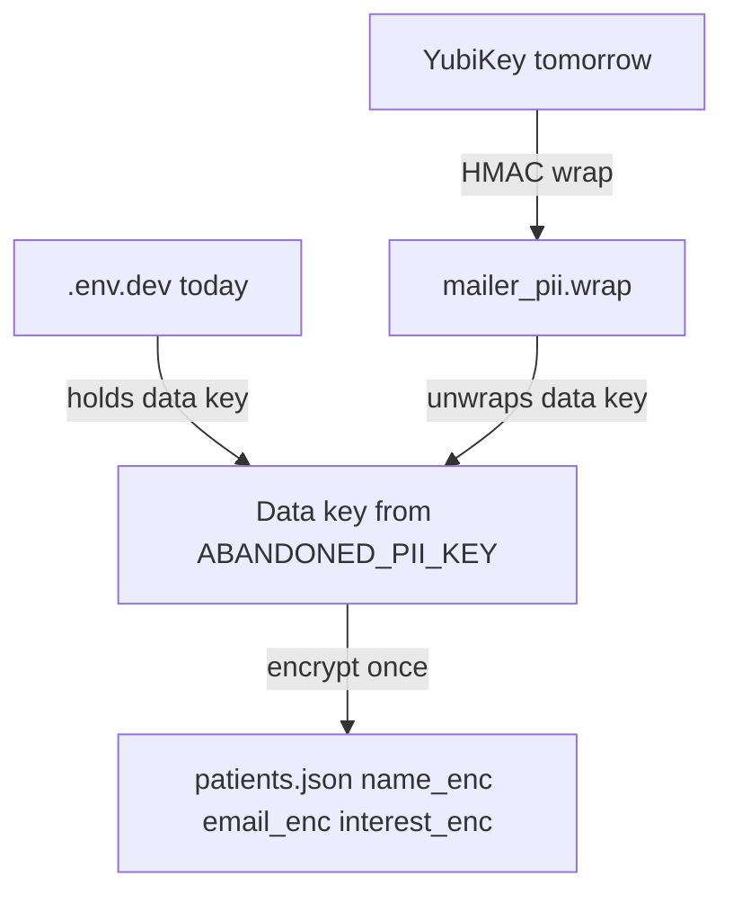
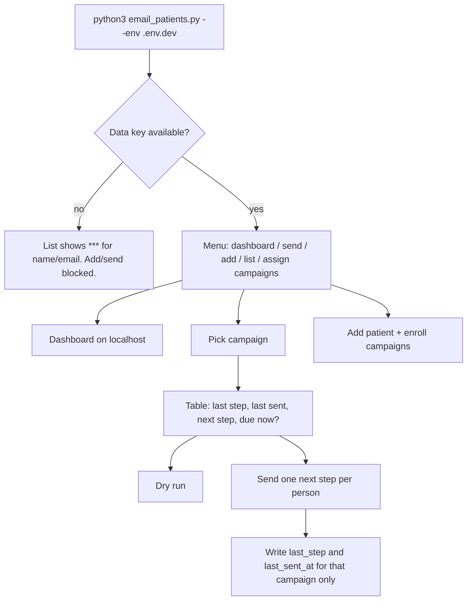
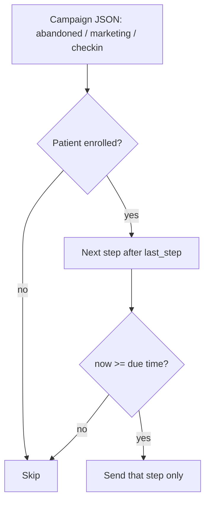

# Patient email campaigns

Local-only mailer for Beema Health. Patient names, emails, and interests are encrypted on disk. Campaign copy lives in plain JSON (no PHI). This is not Bask and not the public website.

## How to run

```bash
python3 email_patients.py --env .env.dev
python3 email_patients.py --env .env.dev --ui
```

`--ui` opens `http://127.0.0.1:8787`. Do not expose that port. PHI never goes to GTM, ads, or git.

## Files

| Path | PHI? | Role |
|---|---|---|
| `patients.json` | Yes | Encrypted patient records. Gitignored. |
| `.env.dev` | Secret | `ABANDONED_PII_KEY` (data key) and SMTP |
| `mailer_pii.wrap` | Secret | YubiKey-wrapped copy of the data key (later) |
| `mailer_yk_challenge.bin` | No | Public YubiKey challenge |
| `campaigns/*.json` | No | Campaign steps, delays, subject, body |
| `public/beema-lockup.jpg` | No | Email header image |
| `mailer/` | No | Engine, CLI, dashboard |

Add a campaign by adding `campaigns/new-name.json`. No Python change required unless you need new placeholders.

## Encryption (not double-encrypting patients)



Patient rows are encrypted **once** with the data key.

YubiKey does **not** encrypt each name again. It wraps the data key:

1. Today the data key sits in `.env.dev`.
2. Tomorrow you tap the YubiKey. That HMAC wraps the same data key into `mailer_pii.wrap`.
3. You remove `ABANDONED_PII_KEY` from `.env.dev` (keep a backup in a password manager).
4. Later unlocks: tap YubiKey → unwrap data key → decrypt the same `patients.json`.

If the data key still lived in `.env.dev` after wrapping, the YubiKey would not add protection. The wrap only helps after the plaintext key is removed from disk.

## Patient record

Each person can be in **multiple** campaigns. Each campaign has its own step clock.

```json
{
  "id": "a1b2c3d4e5f6",
  "name_enc": "...",
  "email_enc": "...",
  "interest_enc": "...",
  "email_hmac": "...",
  "product": "weight-loss",
  "status": "abandoned",
  "abandoned_at": "2026-08-26T09:37:00-06:00",
  "campaigns": {
    "abandoned": {
      "enrolled": true,
      "enrolled_at": "2026-08-26T09:37:00-06:00",
      "last_step": "10m",
      "last_sent_at": "2026-08-26T09:50:00-06:00"
    },
    "marketing": {
      "enrolled": true,
      "enrolled_at": "2026-08-26T09:37:00-06:00",
      "last_step": null,
      "last_sent_at": null
    },
    "checkin": {
      "enrolled": false,
      "enrolled_at": null,
      "last_step": null,
      "last_sent_at": null
    }
  }
}
```

## Session flow



## Send rules



Abandoned due time is based on `abandoned_at`. Marketing and check-in use `enrolled_at`. A person gets **one next step per campaign per run**, never every step at once.

## Dashboard

The UI is for operators on this laptop:

- Patient table with campaign chips (due vs waiting)
- Select a patient: toggle campaigns, send that person's due email
- Campaign picker: show due list, then send
- Add patient: name, email, status, abandoned time, campaign checkboxes

If the data key is missing, the table shows `***`.

## Adding a campaign later

1. Copy `campaigns/marketing.json` to `campaigns/your-id.json`.
2. Set `id`, `label`, `anchor` (`abandoned_at` or `enrolled_at`), `cta_url`, and `steps`.
3. Restart the mailer. Patients get an empty campaign slot automatically.

Placeholders in subject/body: `{first_name}`, `{interest}`, `{product}`, `{email}`.

## YubiKey tomorrow

1. USB-C adapter in, YubiKey in.
2. `brew install ykman`
3. `ykman otp chalresp --touch --generate 2` once.
4. Mailer menu: **Lock with YubiKey**.
5. Confirm a list still decrypts names.
6. Backup `ABANDONED_PII_KEY`, then remove it from `.env.dev`.
