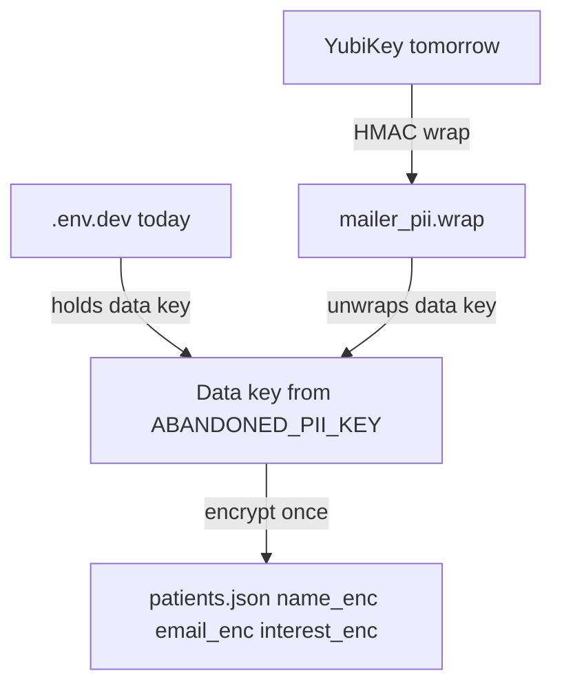
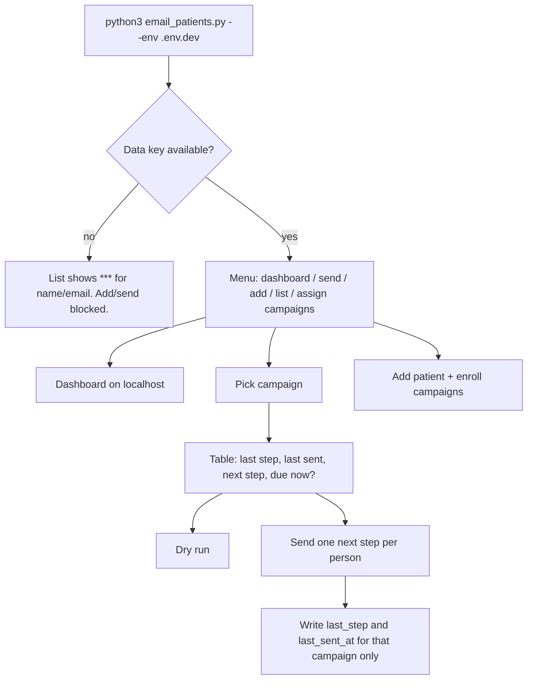
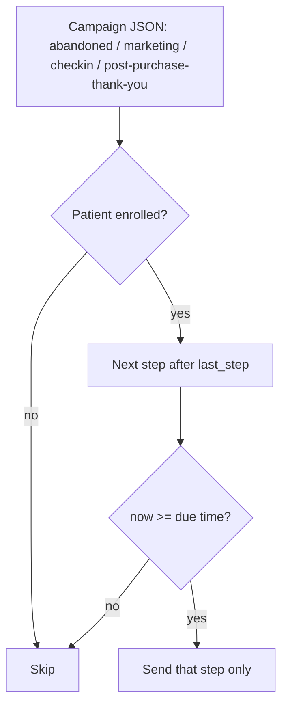

# Patient email campaigns

Local-only mailer for Beema Health. Patient names, emails, and interests are encrypted on disk. Campaign copy lives in plain JSON (no PHI). This is not Bask and not the public website.

## How to run

```bash
./mailer.sh
python3 email_patients.py --env .env.dev --mode prod --ui
```

`./mailer.sh` opens the dashboard in Dev. Pass `--mode prod` after it to start in Prod. The Python package folder is `mailer/`, so the shortcut cannot be named `./mailer`.

`--ui` opens `http://127.0.0.1:8787`. Do not expose that port. PHI never goes to GTM, ads, or git.

## Tests

```bash
python3 -m unittest discover -s mailer -p "test_*.py"
```

Tests are split by module (`mailer/test_campaigns.py`, `mailer/test_store.py`, `mailer/test_engine.py`, `mailer/test_emailing.py`, `mailer/test_crypto.py`, `mailer/test_richtext.py`, `mailer/test_scheduler.py`, `mailer/test_dashboard.py`, `mailer/test_mode.py`), each mirroring the `mailer/*.py` file it covers, plus `mailer/testing_support.py` for shared fixtures (`make_patient()`, `dashboard_html()`). Keep each file under ~1500 lines - add a new topic file rather than growing one.

## Dev vs Prod (local)

Both modes share campaign copy in `campaigns/` and the same SMTP settings. Only the patient list is split.

| Mode | Patient file | Campaigns you can send |
|---|---|---|
| `dev` (default) | `data/dev/patients.json` | All campaigns, including ones still being tested |
| `prod` | `data/prod/patients.json` | Only campaigns with `"ready": true` |

Switch in the dashboard header, or pass `--mode`. Switching to Prod asks for confirm. Dev test patients never mix into the Prod file.

The first time you run the mailer, if `patients.json` still sits at the repo root, it is copied into `data/dev/patients.json` so current test work keeps working. Prod starts empty until you add real patients there.

After a campaign looks right in Dev, check **Ready for prod** (or set `"ready": true` in the JSON). Prod will then send it. Post-purchase thank you starts as not ready so you can test it on Dev first.

Do not git-commit either patient file.

## Files

| Path | PHI? | Role |
|---|---|---|
| `data/dev/patients.json` | Yes | Encrypted test patients. Gitignored. |
| `data/prod/patients.json` | Yes | Encrypted real patients. Gitignored. |
| `patients.json` | Yes | Legacy file. Copied into Dev on first run if the new files are missing. |
| `.env.dev` | Secret | `ABANDONED_PII_KEY` (data key) and SMTP |
| `mailer_pii.wrap` | Secret | YubiKey-wrapped copy of the data key (later) |
| `mailer_yk_challenge.bin` | No | Public YubiKey challenge |
| `campaigns/*.json` | No | Campaign steps, delays, subject, and body (string or paragraph array) |
| `campaigns/_history/*.jsonl` | No | Append-only version history per campaign, committed to git |
| `public/beema-lockup.jpg` | No | Full-width HTML header lockup - bee mark, divider, "Beema Health" wordmark, "TELEHEALTH - WELLNESS - RESULTS" tagline. 960x460 JPEG (tight-cropped so the artwork fills the header width), ~72KB. Rendered `width:100%` of the 600px body. A `beema-lockup.png` at the same stem wins if present. |
| `public/favicon-beema.png` | No | Square bee mark, MIME inline |
| `public/bimi/logo.svg` | No | BIMI SVG Tiny P/S for DNS |
| `mailer/` | No | Engine, CLI, dashboard |

Add a campaign by adding `campaigns/new-name.json`. No Python change required unless you need new placeholders.

Current campaigns:

| ID | Label | Use |
|---|---|---|
| `abandoned` | Abandoned checkout | Started a visit, did not finish |
| `marketing` | Marketing | Education before a purchase |
| `checkin` | Check-in | How care is going after intake |
| `post-purchase-thank-you` | Post-purchase thank you | After a completed buy: thanks, support@, optional Google review for a $100 coupon. Starts not ready for Prod. |

## Encryption (not double-encrypting patients)



Patient rows are encrypted **once** with the data key.

YubiKey does **not** encrypt each name again. It wraps the data key:

1. Today the data key sits in `.env.dev`.
2. Tomorrow you tap the YubiKey. That HMAC wraps the same data key into `mailer_pii.wrap`.
3. You remove `ABANDONED_PII_KEY` from `.env.dev` (keep a backup in a password manager).
4. Later unlocks: tap YubiKey → unwrap data key → decrypt the same `patients.json`.

If the data key still lived in `.env.dev` after wrapping, the YubiKey would not add protection. The wrap only helps after the plaintext key is removed from disk.

## Patient record

Each person can be in **multiple** campaigns. Each campaign has its own step clock.

```json
{
  "id": "a1b2c3d4e5f6",
  "name_enc": "...",
  "email_enc": "...",
  "interest_enc": "...",
  "email_hmac": "...",
  "product": "weight-loss",
  "status": "abandoned",
  "abandoned_at": "2026-08-26T09:37:00-06:00",
  "campaigns": {
    "abandoned": {
      "enrolled": true,
      "enrolled_at": "2026-08-26T09:37:00-06:00",
      "last_step": "10m",
      "last_sent_at": "2026-08-26T09:50:00-06:00"
    },
    "marketing": {
      "enrolled": true,
      "enrolled_at": "2026-08-26T09:37:00-06:00",
      "last_step": null,
      "last_sent_at": null
    },
    "checkin": {
      "enrolled": false,
      "enrolled_at": null,
      "last_step": null,
      "last_sent_at": null
    }
  }
}
```

## Session flow



## Send rules



A person gets **one next step per campaign per run**, never every step at once.

**When a step is due** (`due_at_for` in `mailer/store.py`): its `delay` is added to the campaign's **last send for that patient** (`last_sent_at`), or - if nothing has been sent yet - to the **anchor** (`abandoned_at`, or `enrolled_at` for check-in / marketing). So each step's delay is measured from the previous step's send, and editing a patient's "Last sent at" in the editor shifts every later step with it. The "Time to next step" column and the editor's `wait until` line both reflect this.

Because delays chain from the last send, a campaign's total run time is the **sum** of its step delays, not its largest one. If you want the abandoned drip to finish ~14 days after the abandon, write the step delays as gaps between sends (10m, then 5m, then 15m, ...), not as offsets from the abandon time.

## Automation (per-campaign scheduler)

Each campaign can run itself on a schedule, configured in the **Automation** tab of the campaign editor. A scheduled run does exactly what the **Send due emails** button does: for every enrolled patient whose next step is due, it sends that one step.

**It is in-process only.** A background thread inside the running mailer UI checks every `TICK_SECONDS` (30s). It only runs while `./mailer.sh` is open **and the laptop is awake**. On wake, the next tick catches up any window it slept through, because "due" is computed from the clock plus a persisted last-run timestamp (`data/scheduler.json`), not a live timer. For true always-on, run the mailer on a machine that never sleeps - no code changes.

Schedule shape, stored on the campaign JSON as `schedule`:

```json
"schedule": { "enabled": true, "kind": "interval", "every_minutes": 60 }
"schedule": { "enabled": true, "kind": "weekly", "days": ["mon","wed","fri"], "time": "09:00" }
```

- `kind: "interval"` - run every N minutes (1 to 10080). "Every 1 hour" is the intended abandoned-checkout setting.
- `kind: "weekly"` - run on the listed weekdays (`mon`..`sun`) at `time` (`HH:MM`, 24-hour).
- All times are **America/Denver**.
- `enabled: false` keeps the day/time config so toggling off does not lose it. An unconfigured campaign has no `schedule` block.

Rules the scheduler still respects:

- **Prod mode + `ready: false` = nothing sends** (same as a manual send).
- **PII locked** (no key / YubiKey not tapped) = the run is skipped and recorded as an error; it retries on the next tick once unlocked.
- One next step per patient per tick. A backlog of overdue steps drains one step per tick.

**Testing:** set step delays to `2m`, set the schedule to "every 2 minutes", keep the mailer open, watch it drain. The **Run now** button in the Automation tab fires the same path immediately (and stamps `last_run` so the schedule does not double-fire). `POST /api/campaigns/{id}/run-now`; status at `GET /api/scheduler`.

### Patients tab: countdown, pause/resume, preview

The Patients tab shows live automation status without opening the campaign editor:

- **Countdown** - "Automation: next check ... in Xh Xm Xs", ticking down to the second. Scoped to whichever campaign the patient list is filtered to, or the soonest across all campaigns when unfiltered. Says plainly when the scheduler thread is not running at all (`./mailer.sh` not open) versus running but paused versus running with nothing scheduled.
- **Pause automation / Resume automation** - one button, global, stops or starts every campaign's schedule at once. `POST /api/scheduler/pause` / `POST /api/scheduler/resume`; state lives in `data/scheduler.json` under the reserved `__global__` key (campaign ids can't contain `_`, so this never collides with a real campaign). **Resuming resets every enabled campaign's clock to a fresh full interval starting from that moment** - it does not pick back up from the old last-run time, so turning automation back on never immediately fires a backlog of catch-up sends just because the pause outlasted the interval. `set_paused()` in `mailer/scheduler.py`.
- **Preview automation** - dry-runs every automation-enabled campaign (skipping ones not ready for prod, in Prod mode) and lists exactly who is due right now, i.e. what the next successful tick would send. Sends nothing, changes nothing. `GET /api/scheduler/preview`; `preview_next_run()` in `mailer/scheduler.py`.

## Adding or editing a campaign

Use the **Campaigns** panel in the dashboard (see below) - it is a full form editor, no
JSON hand-editing required. It writes the same `campaigns/{id}.json` files described
here, so the two approaches stay compatible.

To add one by hand instead:

1. Copy `campaigns/marketing.json` to `campaigns/your-id.json`.
2. Set `id`, `label`, `anchor` (`abandoned_at` or `enrolled_at`), and `steps`. Add a `buttons` entry plus a `[[button:N]]` token to any step that needs a call-to-action.
3. Leave `"ready": false` until it looks right in Dev. Check Ready for prod (or set `"ready": true`) when you want Prod to send it.
4. Restart the mailer. Patients get an empty campaign slot automatically.

### Placeholders

Built-in tokens, always available in any subject / greeting / body paragraph / closing (no `placeholders` entry needed):

| Token | Becomes | Who / what it is |
|---|---|---|
| `{first_name}` | e.g. `Alex` | The **recipient** patient's first name |
| `{email}` | e.g. `alex@example.com` | The **recipient's** email address |
| `{interest}` | e.g. `weight-loss care` | What the **recipient** said they want, from their record |
| `{product}` | e.g. `weight-loss` | The **recipient's** product line, from their record |
| `{support_email}` | `support@beemahealth.com` | The Beema support inbox - same for every campaign, not overridable |

`support_email` is a built-in (`BUILTIN_PLACEHOLDERS` in `mailer/campaigns.py`, value = `SUPPORT_EMAIL` in `mailer/emailing.py`). If a campaign JSON lists `support_email` (or any other built-in) under `placeholders`, it is stripped on save. Built-ins always win over anything in `placeholders`.

`placeholders` is only for **custom** campaign-specific tokens (for example `{coupon_amount}` = `$100`). The Placeholders tab in the dashboard editor shows the built-in reference table (with an inline "Example in an email" column and a **?** button per row that opens a popup of several example values and example sentences - sourced from the `VAR_HELP` map in `index.html`) plus the custom-variable rows.

### Campaign JSON body

JSON cannot wrap one long string across lines. Put each paragraph in a `body` array. The mailer joins those strings with two newlines, so the email shows a blank line between paragraphs.

Each paragraph string may contain a small set of inline formatting tags -
`<b>`/`<strong>`, `<i>`/`<em>`, `<u>`, `<s>`, `<a href>`, `<ul>/<ol>/<li>`, `<br>`.
These are what the dashboard's rich-text body editor (Bold/Italic/Underline/Strike,
lists, links) produces. Anything else (scripts, other tags, attributes, styles) is
stripped on save by `mailer/richtext.py` - that sanitizer is the real boundary, not
the dashboard UI, so hand-edited JSON gets the same treatment the next time it is
saved through the editor.

### Call-to-action buttons and the campaign CTA link

There is **no automatic CTA button** - a step only shows a button if you add one.

- Add a `buttons` array to the step. Each entry needs a `label`; `url` is
  **optional**. Optional: `align` (`left`/`center`/`right`), `bg`, `color`
  (6-digit hex).
- Put a `[[button:N]]` token on its own line in `body` where the button should
  appear (`N` is the 0-based index into `buttons`). Text can follow it.
- Max 5 buttons per step. A token with no matching entry renders as plain text.

**Campaign `cta_url` = the base link for every step.** Put the shared link with
its shared UTMs there (Details tab), e.g.
`https://hive.beemahealth.com/?utm_source=beema_email&utm_medium=email&utm_campaign=abandoned_checkout`.
At render time, a button with **no `url` of its own** resolves to:

```
<base link>&utm_content=<step id>
```

- `<base link>` = the step's `cta_url` if it has one, else the campaign
  `cta_url`, else the recipient patient's `cta_url` (last-resort fallback).
- `utm_content` is set to the step id (replacing any existing one), so step `3h`
  links to `...&utm_content=3h`. Changing the campaign link updates every
  URL-less button on the next send.
- A button with its own `url` is used verbatim - no `utm_content` added.
- A URL-less button with no base link anywhere makes the campaign fail to save.

`with_utm_content()` in `mailer/campaigns.py` does the append/replace;
`render_html` / `render_plain` call it per button.

In the dashboard: the step body editor's **Button** control opens a dialog
(label, alignment, colors, URL) - leave the URL blank to ride the CTA link. Each
step also has a **CTA link override** field with a live preview, and the Details
tab explains the `utm_content` behaviour. `cta_label` is a per-step label
override; the standalone campaign `cta_label` is otherwise unused.

```json
{
  "id": "abandoned",
  "label": "Abandoned checkout",
  "anchor": "abandoned_at",
  "cta_url": "https://hive.beemahealth.com/?utm_source=beema_email&utm_medium=email&utm_campaign=abandoned_checkout",
  "steps": [
    {
      "id": "10m",
      "delay": "10m",
      "subject": "Finish your Beema Health visit",
      "body": ["You left a visit unfinished.", "[[button:0]]"],
      "buttons": [
        { "label": "Continue your visit" }
      ]
    }
  ]
}
```

Step `10m`'s button links to
`https://hive.beemahealth.com/?utm_source=beema_email&utm_medium=email&utm_campaign=abandoned_checkout&utm_content=10m`.
A string `body` still works for older campaign files.

## Campaign versioning and history

Every save through the dashboard editor (or through `mailer.campaigns.save_campaign`)
stamps the campaign and each of its steps with a version number and appends a full
snapshot to an append-only log at `campaigns/_history/{id}.jsonl` - one JSON line per
save, committed to git alongside the campaign copy. **Nothing is ever rewritten or
deleted from that log**, including when a campaign is deleted (a `deleted_at` marker
is appended instead) or renamed (the old id's log gets a `renamed_at` marker).

- The campaign's `version` bumps on every save. A step's `version` only bumps when
  that step's own delay/subject/body/CTA actually changed - editing one step does not
  bump the others.
- Every row in the Sent emails table (and the per-patient sent list) shows which
  `campaign_version`/`step_version` was actually mailed, so you can tell exactly what
  copy a given send used even after the step has since been edited again.
- The Campaigns panel has a **Version history** button per campaign that lists past
  saves with a **Restore into editor** action. Restoring only loads that snapshot back
  into the form - it does not write anything until you hit Save, which itself creates
  a new version rather than overwriting.
- A deleted-then-recreated campaign with the same id keeps counting versions upward
  instead of resetting to 1, since the history log (not just the live JSON file) is
  the source of truth for the next version number.

## Dashboard

The UI is for operators on this laptop:

- Mode switcher: Dev (test patients) vs Prod (real patients). In Prod a fixed red banner sits above the header; its **&times;** hides it for the session (still in Prod - the red outline stays). Re-entering Prod shows it again.
- Patient table: Name / Email / Status / Campaigns (enrolled chips) / **Time to next step** (per enrolled campaign, a countdown like `in 2h 10m`, `due now`, `waiting on anchor`, or `done`, from `campaign_summary.seconds_until`)
- Sent emails table: every send to every guest (with campaign/step version), plus a per-patient list in the editor
- Right column, top to bottom: **Send a campaign** (own panel, always visible), **Edit patient**, **Campaigns**, **Ready for prod**
- Send a campaign is independent of the selected patient: campaign select, due list, send due emails
- Edit patient: Save in the top right and bottom right of that panel (same handler). Click the selected row again or **Clear selection** to deselect without a refresh
- **Duplicate to Prod** (patient editor, Dev only): one click copies the selected Dev patient into `data/prod/patients.json` - a fresh id, but everything else carried over exactly (status, `abandoned_at`, `cta_url`, and every campaign's `enrolled` / `enrolled_at` / `last_step` / `last_sent_at`), so the Prod copy resumes from wherever the Dev test left off. Refuses if that email is already in Prod. `duplicate_patient_to_prod()` in `mailer/engine.py`; `POST /api/patients/{id}/duplicate-to-prod`.
- **Campaigns**: create, edit, and delete campaigns and their steps with plain form fields - no JSON editing. Editor tabs are Details / Placeholders / Steps / Automation / History. Step bodies use a rich-text editor (Bold/Italic/Underline/Strike, lists, links, inline buttons); steps can be added, reordered, previewed, force-sent to one patient, and deleted (double-confirm trash icon in the step title row). See Campaign versioning above and Automation below.
- Ready for prod checkboxes: Dev only. Hidden in Prod. Prod only sends campaigns marked ready. The same `ready` field is also editable inside each campaign's form.
- Clear send history (Dev only, hidden in Prod): wipes the send log and resets every patient's last step/last sent time on every campaign so drips can fire again. Confirm-guarded and cannot be undone. The API rejects the call in Prod.
- Select a patient: each campaign is a dropdown titled with the campaign name
- Last step is a dropdown of that campaign's steps, plus a blank option to start at the first step on the next send
- Add patient: name, email, status, abandoned time, plus a named dropdown per campaign. Campaigns start unenrolled until you check Enroll. Status Abandoned does not auto-enroll Abandoned checkout.

If the data key is missing, the table shows `***`. A blank last-step value is the same as clearing the old text field: the next send starts at step one.

## Inbox avatar / BIMI

A CID image in the HTML body is **not** the inbox avatar. Apple Mail
showing **BH** is generated from the From display name
`Beema Health`. Yahoo Mail, Gmail, and Apple Mail do not use the
lockup JPEG as the list-view photo.

What the mailer now does:

- From is always `Beema Health <support@...>` (or whatever SMTP address
  is configured). That keeps the Apple initials as BH, not a random
  pair.
- Header is the full-width lockup (`public/beema-lockup.jpg`, ~70KB), attached
  as `Content-Disposition: inline` with `Content-ID: <beema-lockup>`, greeting
  and intro text immediately below. `resolve_logo()` uses a `beema-lockup.png`
  first if one exists, else the JPEG; if neither exists the send still goes out
  without the header image, never with an error.
- Square bee mark (`public/favicon-beema.png`) is also inline
  (`cid:beema-mark`) and shown in the footer. Some clients still ignore
  this for the avatar. It can show as a related image, not as Yahoo's
  own logo. We never attach Yahoo's trademark.
- `BIMI-Selector: v=BIMI1; s=default;` tells supporting providers which
  DNS selector to look up.
- `List-ID: Beema Health <campaigns.beemahealth.com>` is RFC 2919.
- `public/bimi/logo.svg` is a square SVG Tiny P/S file for BIMI. It
  must be live at `https://beemahealth.com/bimi/logo.svg` after the
  marketing site is deployed.

What that does **not** do:

**Apple Mail.** Inbox BH is a monogram from "Beema Health". BIMI
only shows if the mailbox provider asserts it (Apple documents a
VMC / evidence document). Apple Business Connect Branded Mail is a
separate Apple review. A CID image will not replace BH.

**Yahoo Mail.** Inbox logo is BIMI on the From domain.
Self-asserted BIMI is enough (no VMC). Needs DMARC `p=quarantine`
or `p=reject`, a live SVG, bulk volume, and sender reputation. Yahoo
will not show a logo on personal-volume mail.

**Gmail.** BIMI needs a paid VMC. Not implemented here. Gmail may
also use its own brand directory, which we do not control.

### DNS Matt must add

Confirm DMARC is enforced. Check with:

```bash
dig TXT _dmarc.beemahealth.com
```

You want `p=quarantine` or `p=reject` (not `p=none`). SPF and DKIM
must align with `beemahealth.com` (Google Workspace DKIM if you send
through Gmail SMTP as `support@beemahealth.com`).

After `https://beemahealth.com/bimi/logo.svg` is on production, add
this TXT at the registrar (Cloudflare, Google Domains, etc.):

- Type: TXT
- Host / name: `default._bimi`
- FQDN: `default._bimi.beemahealth.com`
- Value:
  `v=BIMI1; l=https://beemahealth.com/bimi/logo.svg;`
- TTL: 3600

Do not add an `a=` VMC URL until you buy a Verified Mark Certificate.
Yahoo can display the `l=` SVG without `a=`. Gmail will not.

Check the record:

```bash
dig TXT default._bimi.beemahealth.com
```

Yahoo's path is BIMI, not a per-recipient Yahoo logo:
[Yahoo Sender Hub BIMI](https://senders.yahooinc.com/bimi/). If the
logo still does not show after DNS and DMARC are correct, Yahoo also
requires bulk volume and engagement on that From address. Use Yahoo
Sender Hub support if those are already in place.

Apple Branded Mail (separate from BIMI): verify the business at
[Apple Business Connect](https://businessconnect.apple.com) and upload
the square bee mark (`public/beemahealth-logo.png` or
`public/favicon-beema.png`). Until Apple or BIMI is approved, Apple
Mail will keep showing BH.

Do not commit patient files. Deploy the SVG with the marketing site
before publishing the TXT record.

## YubiKey tomorrow

1. USB-C adapter in, YubiKey in.
2. `brew install ykman`
3. `ykman otp chalresp --touch --generate 2` once.
4. Mailer menu: **Lock with YubiKey**.
5. Confirm a list still decrypts names.
6. Backup `ABANDONED_PII_KEY`, then remove it from `.env.dev`.
